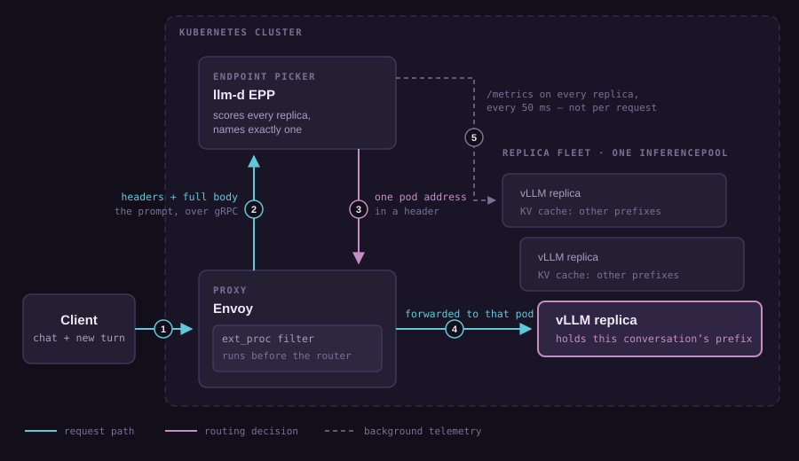
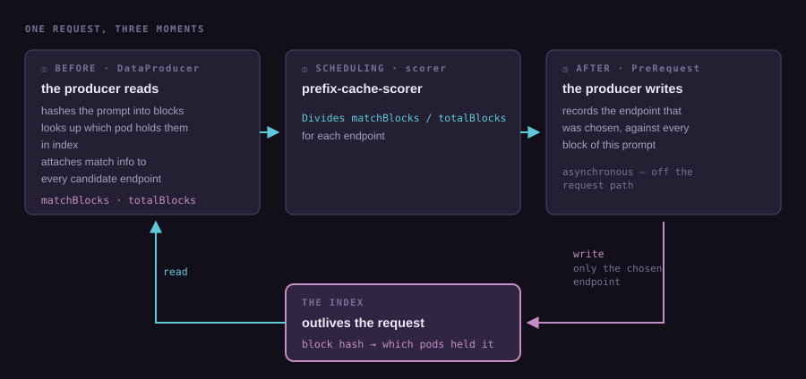
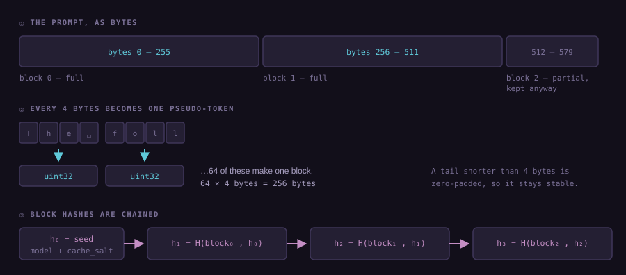
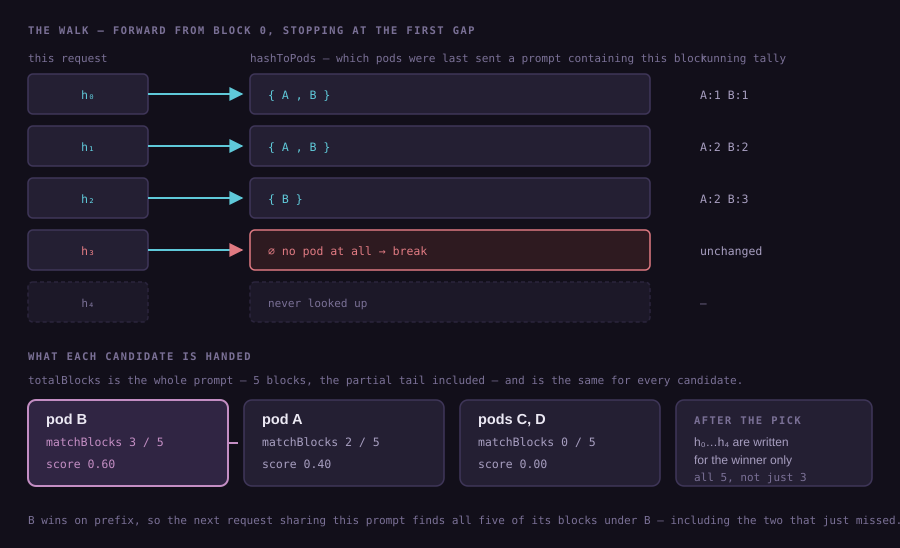
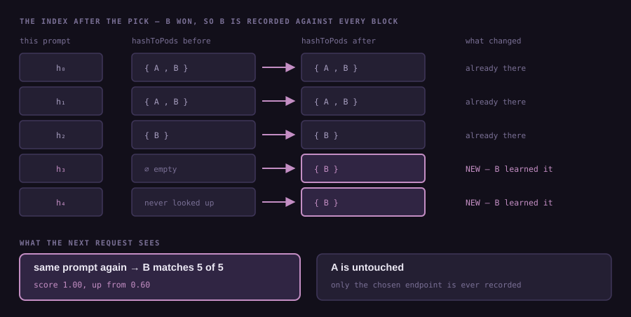

The first thing that struck me comparing typical HTTP request routing with routing for LLM inference was the importance of KV-cache-aware routing. A model has to build a KV cache entry for every token of the prompt before emitting the first token. On any prompt with non-trivial token count, prefill will dominate time-to-first-token.

In a typical conversation, each request builds on the previous request; the new prompt starts with the old one. If we can go back to the same replica that served the previous request, we can re-use the existing KV cache blocks and generate only the new ones. If we end up on a new replica, then the whole KV cache has to be generated again.

The routing layer needs to be aware of KV cache distribution, something that a general-purpose proxy won't know anything about. The research led me down to [llm-d-router](https://github.com/llm-d/llm-d-router) and how it implements KV-cache-aware routing. This post omits the disaggregated stack (prefill and decoding in separate pools) for simplicity.

---

## Part 1 — Where the EPP sits

### The proxy delegates the routing decision


All the intelligence of picking up the right endpoint is delegated to the EPP which can score and find the best endpoint for serving the request. The proxy does the mechanical part of routing the request to that endpoint. Having spent a lot of time working on HTTP proxies, it was a shock to see an external request being made on the hot path. But then the overall latency budget is much larger for LLM calls (proxy overhead in microseconds vs. typical LLM request latency in the hundreds of milliseconds to seconds), so the trade-off is understandable. On cursory research, it does look like some other [solutions](https://github.com/vllm-project/router) do ship inline routers.

---

## Part 2 — How the EPP decides

### Builds state off the request path

The main concept to internalize is that the EPP builds a view of the cluster aka LLM replicas off the request path by scraping metrics off every pod in the pool in the background. The scoring and picking an endpoint happen over already collected state in the hot path.

### Scorers compose into a profile

The EPP isn't a fixed algorithm. It's a plugin framework: you declare which
scorers exist, then declare a *scheduling profile* that references them with
weights.

```yaml
apiVersion: llm-d.ai/v1alpha1
kind: EndpointPickerConfig
plugins:
  - type: queue-scorer
  - type: kv-cache-utilization-scorer
  - type: prefix-cache-scorer
schedulingProfiles:
  - name: default
    plugins:
      - pluginRef: queue-scorer
        weight: 2
      - pluginRef: kv-cache-utilization-scorer
        weight: 2
      - pluginRef: prefix-cache-scorer
        weight: 3
```

Each scorer returns one value per endpoint in [0,1], higher being better. The
profile combines them with a plain weighted sum:

```
for each scorer:
    total[endpoint] += clamp(score, 0, 1) × scorer.weight
```

A picker then reduces the scored set to an answer; the default max-score-picker takes the highest. 

In this example, everything else being equal, prefix-cache-scorer will return higher score for endpoints where the prefix match is higher, pushing the picker to choose that endpoint.

Next we will focus on the prefix matching part to understand how the EPP finds the endpoint with the highest match for the prefix.

### One producer, and what it has to promise

The scorer is trivial. Its entire output is
`matchBlocks / totalBlocks`, two integers it does not compute.
Everything interesting happens in the plugin that puts those integers there.

That plugin is a **data producer**, and the default is
`approx-prefix-cache-producer`. There are other options: a precise producer, a
burst producer and a multi-cluster variant all attach the same attribute from
different sources, and the rest of this post follows only the approximate one.

The contract is two numbers, attached to every candidate endpoint:

| Field | Meaning |
|---|---|
| `matchBlocks` | how many blocks of this prompt that endpoint is believed to already hold |
| `totalBlocks` | how many blocks this prompt has in total |

The scorer reads those, divides, and returns. It has no idea whether they came
from routing history, from real cache events, or from a batch placement decision.

### Two phases, and the loop between them

The producer runs **twice per request**, on either side of picking the endpoint.



The first invocation of the producer turns the prompt into block hashes and asks the
index who holds them to produce match info for each endpoint. The scorer divides that. The second invocation records the endpoint that actually won, against every block of that prompt. This is the key part which updates the index with distribution of cache blocks for each routed request. When the next request for the same prefix comes in, the updated index will result in the endpoint that served the previous request scoring higher. There is no data coming from endpoints about the real distribution of cache in this strategy, hence the name approximation.

### From prompt to block hashes



This is the scheme used by the approximate producer to tokenize the prompt. It is pluggable and can be replaced by a real tokenizer.

**Blocks are 256 bytes.** Every 4 bytes of the prompt becomes one pseudo-token; 64
pseudo-tokens make a block, so a block is 256 bytes of prompt text.

**The partial tail is kept.** A prompt that doesn't divide evenly still produces a
final short block, and it is hashed and indexed like any other.

**The hashes are chained.** `h₀` is a seed over the model name and `cache_salt`;
every later hash folds in its predecessor. So matching `hᵏ` already proves blocks
0…k all matched. That is why the walk below can just count matches and stop
at the first miss.

### The prefix matching walk

The index is two maps, but matching touches only one of them directly;
`hashToPods`, which maps a block hash to the set of pods last sent a prompt
containing that block.



The walk starts at **block 0 (the front of the prompt, the shortest prefix)**
and moves forward. It stops at the first block held by **no pod at all**, and
blocks after that gap are never looked up. Chaining is what makes stopping safe:
if `h₃` is unknown to everyone, no pod can hold `h₄` either.

**The break is global, not per-pod.** In the diagram, A drops out at `h₂` but the
walk continues because B is still matching. Each pod is tallied independently, so what comes out is a *different*
match length per pod, against one shared `totalBlocks`.

### What the write leaves for the next request

After picking the endpoint, the producer writes **all** of the prompt's block hashes for the winning endpoint. In this example, all 5 blocks would be recorded against endpoint B.



The two blocks that were missing are now indexed: the next request sharing this prompt will find all five, not three.

The index is a record of where this EPP has sent things, not a record of where the cache blocks actually are located.

So the component named `prefix-cache-scorer` turns out to be the least interesting part of prefix-cache routing: it divides two numbers. Everything that makes routing interesting lives in the producer. The uber software engineering lesson is the neat separation of concerns and the pluggable nature of the design. Swap in precise producer for the approximate strategy, and nothing else changes: same scorer, same everything downstream.

---

*P.S. There is a second map in the index, `podToLRU`: a bounded LRU per pod that
owns eviction. I've left it out of this post, since it doesn't change how the walk
works.*
